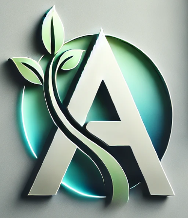

# 🅰️**🌿Aaran Business Management System (Aaran-BMS) 🍃**

Aaran-BMS is a **cutting-edge enterprise business management system** designed to **streamline operations, improve efficiency, and scale businesses** across multiple industries. Built on **Laravel 12 and Livewire**, Aaran-BMS is a **multi-tenant, modular, and highly scalable** solution tailored for **businesses of all sizes**—from small startups to large enterprises.

We provide a **comprehensive suite of tools** covering **manufacturing, retail, finance, HRM, CRM, digital marketing, online shopping, website building, and more**. Our mission is to **empower businesses with technology that adapts to their needs**, ensuring seamless operations and growth.

---

## **🛠️ Why Choose Aaran-BMS?**

### **🏢 Multi-Tenancy Architecture**
✅ **Multi-Tenant & Enterprise-Ready** Each **tenant (business) gets its own database** for security and scalability.  
✅ **Automatic Database Creation** when a new tenant registers.  
✅ **Custom Role-Based Access Control (RBAC)** inside each tenant database.  
✅ **Supports Database Sharding & Replication** for performance optimization.

### **🏭 Industry-Specific Business Management**

> Aaran-BMS is **designed to serve multiple industries**, making it an ideal choice for businesses in:

✅ **Garment, Textile, Printing, Dyeing, Knitting** → Complete manufacturing & production management.  
✅ **Retail & Online Shopping** → **POS, inventory, order management, & payment gateway integration**.  
✅ **Finance (Loans, Chits, Investment)** → Secure money handling, transactions, & growth.  
✅ **Sports Club & Community** → Membership, events, discussion boards, & team management.  
✅ **HRM & CRM** → Payroll, employee tracking, **customer relationship automation**.  
✅ **Help Desk** → Support ticketing system for business customer service.
✅ **Documentation** → Support and internal knowledge management.

### **⚙️ Scalable Core System**
✅ **Service-Oriented Architecture (SOA)** with modular components.  
✅ **Livewire-based UI** for real-time, smooth user experience.  
✅ **Custom Middleware, API Resources, & Microservices Support**.  
✅ **Fully custom RBAC system**.

### **📡 API-Driven & Developer Portal**
✅ **RESTful & GraphQL APIs** for integrations.  
✅ **SDKs & Developer Documentation** for building custom extensions.  
✅ **Modular & Extensible Architecture** → Developers can extend Aaran-BMS **without modifying core files**.

### **🌍 Online Presence & Content Management**
✅ **Website Builder** → No-code page creation for tenants.  
✅ **Blog System** → SEO-optimized blogging platform.  
✅ **Wiki & Document Keeper** → Secure **business knowledge base**.

### **🚀 Custom Auto-Scaling & Deployment** -in future
✅ **Supports Auto-Scaling with Custom Load Balancer** (not serverless).  
✅ **Database Sharding & Replication** for high traffic handling.  
✅ **Custom Deployment (No Laravel Forge or Vapor)** → Full control over infrastructure.

---

## **🌍 Future Plans & Roadmap**
📌 **AI-Powered Automation** → Intelligent business insights, predictive analytics.  
📌 **Advanced BI (Business Intelligence) Tools** → Real-time data-driven decision-making.  
📌 **More Industry-Specific Modules** → Expanding support for **real estate, logistics, healthcare, and more**.  
📌 **Mobile App Integration** → iOS & Android apps for real-time business management.

---

### **🎯 Mission:**
✅ **Provide an All-in-One Platform** → Aaran-BMS eliminates the need for multiple software solutions by offering a **single, unified system**.  
✅ **Multi-Industry Support** → From **garment manufacturing** to **finance & e-commerce**, we cater to diverse business sectors.  
✅ **High Performance & Scalability** → Built with **multi-tenancy, database sharding, and custom auto-scaling**, ensuring reliability even for enterprise workloads.  
✅ **Developer-Friendly & Extensible** → Offers **RESTful APIs, modular architecture, SDKs**, and an open framework for future expansion.

---

## **📞 Contact Us**
🌐 **Website:** Coming Soon!  
📧 **Email:** support@aaranbms.com  
📍 **Headquarters:** To Be Announced

**🚀 Ready to take your business to the next level? Aaran-BMS is here to help!**
